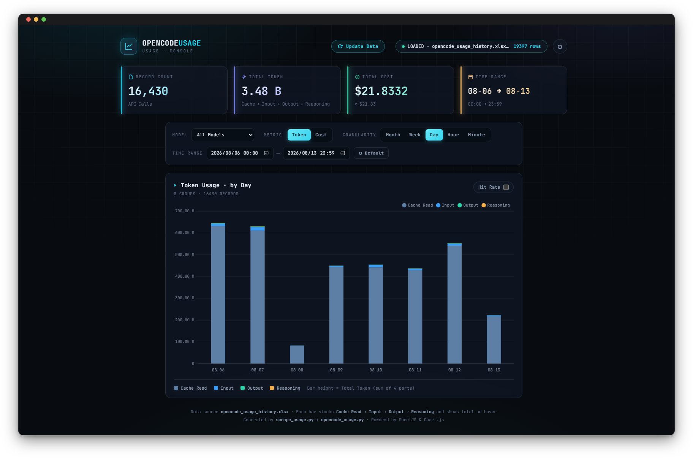

<p align="center">
  
</p>

<h1 align="center">OpenCode Usage</h1>

<p align="center">
  See exactly where your OpenCode tokens and money go.
</p>

<p align="center">
  <a href="https://www.python.org/"></a>
  <a href="https://www.chartjs.org/"></a>
  <a href="https://playwright.dev/"></a>
</p>

---

OpenCode Usage turns your OpenCode spending into a clean, visual dashboard: token volume, cache hit rate, and cost at a glance, with drill-downs by model and by any time range — from months down to individual minutes.



## Features

- **Clear overview** — record count, total tokens, and total cost in cards right at the top
- **Cache insights** — cache hit rate on every bar, plus an overlay line
- **Full time control** — view by month, week, day, hour, or minute, and filter by model
- **Always current** — incremental updates fetch only what's new, and auto-update keeps the dashboard fresh even while you're away
- **Two ways to view** — tokens or cost, light or dark theme, English or Chinese

## Quick Start

```bash
cd opencode_usage
pip install -r requirements.txt
python opencode_usage.py
```

Your browser opens automatically at `http://127.0.0.1:9901`.

## Usage

From the dashboard you can:

- Click **Update** to refresh your usage data
- Open **Settings** to choose your login (GitHub or Google), time range, and update interval
- Enable **Auto Update** to keep data fresh on a schedule, even when the page is closed

To scrape data from the command line instead, run `python scrape_usage.py --help`.

## License

Released under the [MIT License](LICENSE).
